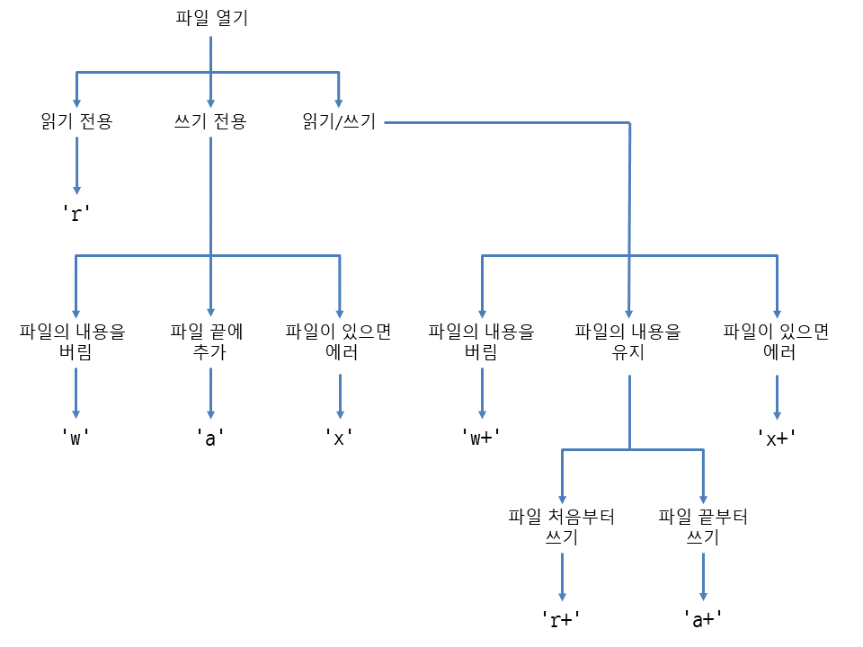

### FILE의  Input  / Output

* 프로그램에서 중요한 처리 중 하나인 파일에 대한 입출력이다
* 파이썬에서 파일의 문열의 객체를 읽거나 쓰는 것은 내장함수인 `open()`함수를 이용해 처리한다

1. 파일의 생성 / 열기 /쓰기는 `open()` 메서드를 호출한다
2. 기본 문법
> `변수(파일객체) = open(파일이름, 열기모드, 인코딩)`

#### 1. 열기 모드

모드   | 설명 |
-------|-------------------------------------------|
| `r` | 읽기 모드 , 파일을 읽기만 허용 |
| `n` |                  |
| `w` | 쓰기모드 , 파일에 내용을 쓸 때 사용|
| `a` | 추가모드 - 파일의 마지막에 새로운 내용을 추가 시킬 때 사용 |
| `t` | 텍스트 모드 |
| `b` | 바이너리 모드 |

### 2. 파일 닫기

1) 작업 종료후 `close()` 함수를 이용하여 작업시에 할 당된 자원들을 해제하여야 한다

### 3. 파일 접근 방식
1. `순차접근`  : 기본값, 파일의 내용을 처음부터 마지막 까지 순차적으로 읽는 방법
2. `임의 접근` : `pointer 관련 메서드` 를 사용한다
> `seek(n)` : 파일에서 첫번째 위치에서 `n번째 Byte`
> `tell()`  : 파일에서 `현재 포인터의 위치`를 리턴

### 4. 파일 관련 메서드

* `open` : 파일 열기
* `close` : 파일 닫기
* `read([size])` : 지정된 size(바이트수) 만큼 파일에서 일기, size를 정하지 않으면 전체파일 읽기
* `file.read(self, n: int = -1)` -파일 전체를 읽는다. 인수값으로 int 값을 넣으면 넣으큼의 문자까지 읽는다.

* `file.readline()` : 한줄씩 읽음, 한줄씩 string 으로 리턴
* `file.readlines()`: 파일 내용 전체 다읽음. 파일 내용 전체를 List 으로 리턴.

